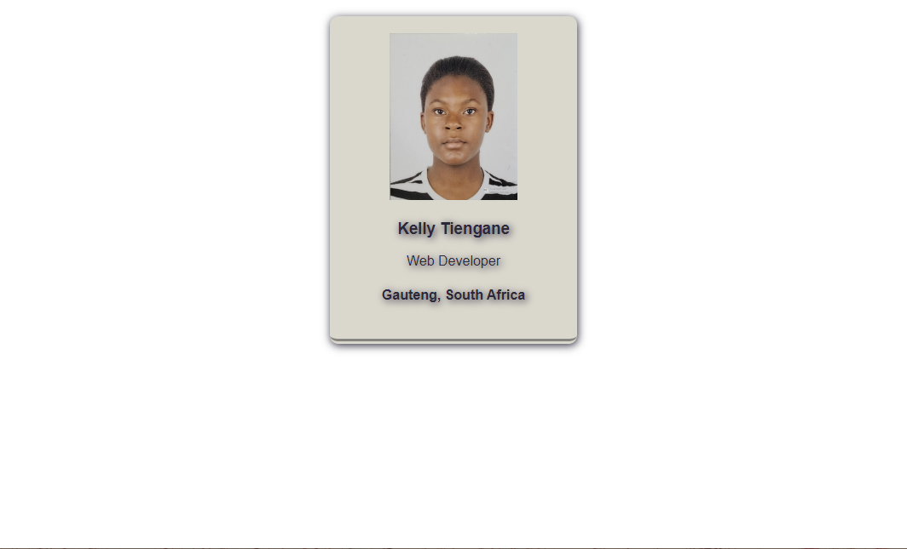

# Business Card

A simple business card featuring your name, expertise, location, and accompanied by a photograph.

<h2>Overview</h2>
<h3>Screenshot</h3>
<h4>Desktop</h4>

<h2>Links</h2>
<ul>
  <li><a href="https://klys-business-card.netlify.app/">Live</a></li>
</ul>

<h2>My Process</h2>
<h3>Languages</h3>
<ul>
  <li>HTML</li>
  <li>CSS</li>
</ul>

<h3>What I learnt</h3>
<ul>
  <li>Font styles (text shadows, transitions, etc.)</li>
  <li>Styling a div container (box shadow)</li>
</ul>

<h2>Acknowledgements</h2>
<ul>
  <li>Scrimba: <a href="https://scrimba.com">Scrimba</a></li>
</ul>

<h2>Author</h2>
<ul>
  <li>Github: <a href="https://github.com/klytne">@klytne</a></li>
  <li>Instagram: <a href="https://www.instagram.com/kly.tne/">@kly_tne</a></li>
  <li>LinkedIn: <a href="https://www.linkedin.com/in/kelly-tiengane-4b72572a6/">Kelly Tiengane</li>
</ul>

