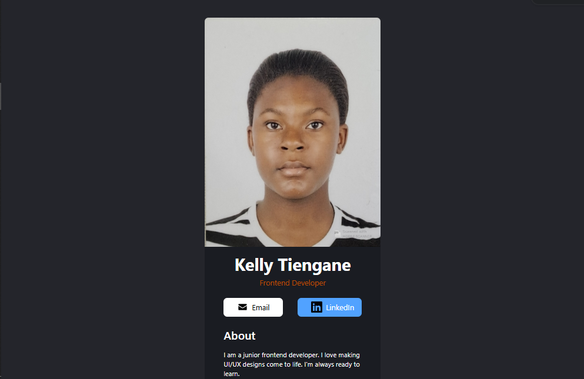

# Business Card - with React + Vite

A simple business card featuring your name, expertise, social links, accompanied by a photograph and a small information section

## Overview
### Desktop

### Mobile

## Links
<ul>
  <li><a href="https://kly-business-card.netlify.app/">Live</a></li>
</ul>

## Note

  This is a updated version of the business card I had created before using HTML and CSS. 

## My Process
### Languages
<ul>
  <li>React</li>
  <li>TailwindCSS</li>
</ul>

### What I learnt
<ul>
  <li>&lt;&gt;...&lt;/&gt; vs &lt;/div&gt;...&lt;/div&gt; as DOM elements</li>
  <li>TailwindCSS custom inline styling</li>
  <li>TailwindCSS responsive styles</li>
</ul>

## Acknowledgements
<ul>
  <li>Scrimba: <a href="https://scrimba.com">Scrimba</a></li>
</ul>

## Author
<ul>
  <li>Github: <a href="https://github.com/klytne">@klytne</a></li>
  <li>Instagram: <a href="https://www.instagram.com/kly.tne/">@kly_tne</a></li>
  <li>LinkedIn: <a href="https://www.linkedin.com/in/kelly-tiengane-4b72572a6/">Kelly Tiengane</li>
</ul>

